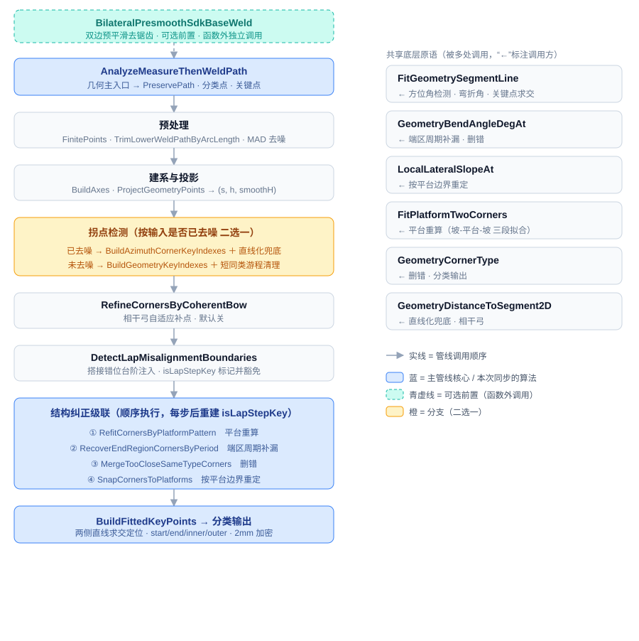
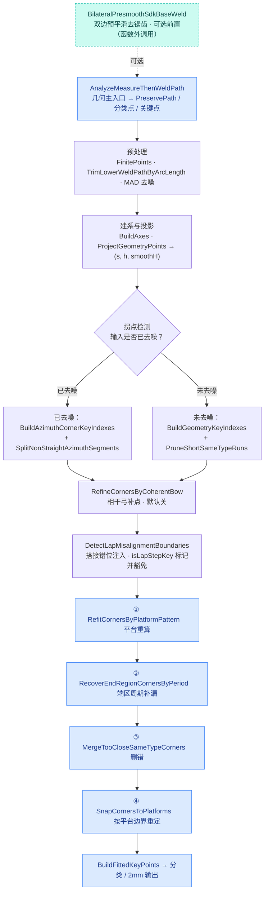

# MeasureThenWeldFilterFit 函数拓扑

「当前在用」的波纹板拐点管线的函数调用拓扑。两部分：① 主入口 `AnalyzeMeasureThenWeldPath` 的**管线调用顺序**；
② 被多处复用的**共享底层原语**及其调用方。与主程序 `RobotCalculation::AnalyzeMeasureThenWeldLowerWeldPathGeometry` 逐步对齐。

## 渲染图



> 上图是自带样式与白底的独立 SVG（`docs/function_topology.svg`），用浏览器 / VS Code / 任意图片查看器打开即可，不依赖任何渲染环境或主题。下面另附 Mermaid 与 ASCII 两个纯文本版本。

## 管线流程（Mermaid，GitHub 可直接渲染）



蓝色 = 主管线核心（本次从主程序同步进来的算法）；青色虚线 = 可选前置；菱形 = 二选一分支。

## 调用树（ASCII，无渲染依赖）

```text
AnalyzeMeasureThenWeldPath
├─ FinitePoints
├─ TrimLowerWeldPathByArcLength          (enableEdgeTruncate)
├─ RemoveLocalOutliers                   (!inputAlreadyDenoised)
├─ BuildAxes
├─ ProjectGeometryPoints
├─ RemoveProjectedBranchOutliers         (!inputAlreadyDenoised)
├─ RemoveSlopeWaveOutliers               (geometryStrategy == SlopeWaveFiltered)
├─ 拐点检测（二选一）
│  ├─ [已去噪] BuildAzimuthCornerKeyIndexes ─→ FitGeometrySegmentLine · Cross2D · GeometrySmoothedProjection2D
│  │           SplitNonStraightAzimuthSegments ─→ GeometryDistanceToSegment2D
│  └─ [未去噪] BuildGeometryKeyIndexes ─→ DouglasPeucker
│              PruneShortSameTypeRuns ─→ GeometryCornerType
├─ RefineCornersByCoherentBow            ─→ GeometryDistanceToSegment2D · Cross2D
├─ DetectLapMisalignmentBoundaries
├─ 结构纠正级联（顺序执行；每步后按 lap 角 s 重建 isLapStepKey）
│  ├─ ① RefitCornersByPlatformPattern    ─→ FitPlatformTwoCorners
│  ├─ ② RecoverEndRegionCornersByPeriod  ─→ GeometryBendAngleDegAt ─→ FitGeometrySegmentLine
│  ├─ ③ MergeTooCloseSameTypeCorners     ─→ GeometryCornerType · GeometryBendAngleDegAt
│  └─ ④ SnapCornersToPlatforms           ─→ LocalLateralSlopeAt
└─ BuildFittedKeyPoints                  ─→ FitGeometrySegmentLine / FitSlopeConsistentSegmentCoreLine · IntersectLines
   分类 / 2mm 加密                         ─→ GeometryCornerType · AppendClassifiedPoint · CountClassification

（独立）BilateralPresmoothSdkBaseWeld     — 由调用方在传入 AnalyzeMeasureThenWeldPath 之前手动调用，不在本调用树内
```

## 共享底层原语（被多处调用）

| 原语 | 作用 | 被调用方 |
|---|---|---|
| `FitGeometrySegmentLine` | (s, smoothH) 段直线 PCA 拟合（裁过渡带 + 方向定向） | 方位角检测 · 弯折角 · 关键点求交 |
| `GeometryBendAngleDegAt` | 某点航向弯折角（左右两段方向夹角，度） | 端区周期补漏 · 删错 |
| `LocalLateralSlopeAt` | 侧向局部斜率 \|dh/ds\|（区分平台/坡） | 按平台边界重定 |
| `FitPlatformTwoCorners` | 「坡-平台-坡」三段拟合（前缀和 O(1) 残差 + 枚举两断点） | 平台重算 |
| `GeometryCornerType` | 按 smoothH 凸起量判内角(inner)/外角(outer) | 删错 · 分类输出 |
| `GeometryDistanceToSegment2D` | 点到弦的 2D 距离（离弦量） | 直线化兜底 · 相干弓 |
| `Cross2D` / `GeometrySmoothedProjection2D` | 2D 叉积 / 取 (s, smoothH) 投影坐标 | 方位角检测 · 相干弓 · 各处 |

> 各函数的逐行注释见 `src/MeasureThenWeldFilterFit.cpp`；新增/对齐记录见 [CHANGELOG.md](CHANGELOG.md)；用法见 [README.md](README.md)。
